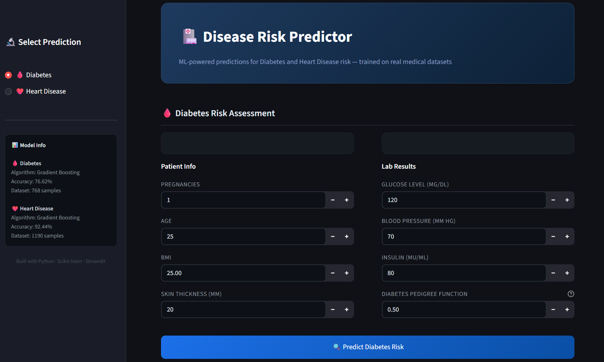

# Disease Risk Predictor


A machine learning web application that predicts the risk of **Diabetes** and **Heart Disease** based on real medical data. Built end-to-end — from data exploration and model training in Jupyter to a deployed interactive web app.

🔗 **Live Demo:** [disease-risk-predictor-1.onrender.com](https://disease-risk-predictor-1.onrender.com)


---

## Screenshots

<!-- Add screenshots after deployment -->


---

## What It Does

- User fills in health metrics (glucose, blood pressure, cholesterol, etc.)
- App runs the input through a trained ML model
- Returns a **risk prediction** (High / Low) with a **confidence probability**
- Supports two diseases — Diabetes and Heart Disease — from one interface

---

## Models & Performance

| Disease | Algorithm | Accuracy | Dataset | Samples |
|---------|-----------|----------|---------|---------|
| Diabetes | Gradient Boosting | 76.62% | Pima Indians Diabetes (UCI) | 768 |
| Heart Disease | Gradient Boosting | 92.44% | Statlog Heart Disease | 1,190 |

The diabetes dataset has a known class imbalance (~2:1 healthy vs diabetic). Every model from Logistic Regression to tuned Random Forest lands in the 70–77% range on this dataset — it's a data ceiling, not a model limitation. The heart disease result of 92.44% reflects a cleaner, larger dataset.

---

## ML Pipeline


- **Data Cleaning** — replaced biologically impossible zero values with column medians; removed 723 duplicate rows from the heart disease dataset
- **Feature Engineering** — created interaction features like `glucose × BMI` and `age × max heart rate` to capture non-linear relationships
- **Class Imbalance** — applied SMOTE on training data only to avoid data leakage into the test set
- **Hyperparameter Tuning** — GridSearchCV with 5-fold CV across 81 parameter combinations (405 total fits)
- **Model Comparison** — evaluated Logistic Regression, Random Forest, Gradient Boosting, and SVM; selected best performer per disease
- **Deployment** — models and scalers saved as `.pkl` files; StandardScaler applied consistently at inference time

---

## Run Locally

### Option 1 — Standard (Anaconda)

```bash
# Clone the repo
git clone https://github.com/a6h101/Disease-Risk-Predictor.git
cd Disease-Risk-Predictor

# Create and activate environment
conda create -n disease-predictor python=3.10
conda activate disease-predictor

# Install dependencies
pip install -r requirements.txt

# Run the app
streamlit run app.py
```

Open `http://localhost:8501` in your browser.

### Option 2 — Docker

```bash
# Build the image
docker build -t disease-risk-predictor .

# Run the container
docker run -p 8501:8501 disease-risk-predictor
```

Open `http://localhost:8501` in your browser.

---

## Tech Stack

| Tool | Purpose |
|------|---------|
| Python 3.10 | Core language |
| Pandas & NumPy | Data manipulation |
| Scikit-learn | ML models, scaling, evaluation |
| imbalanced-learn | SMOTE for class imbalance |
| Matplotlib & Seaborn | Data visualization in notebooks |
| Joblib | Model serialization |
| Streamlit | Web app framework |
| Docker | Containerization |
| Render | Cloud deployment |

---

---

## Disclaimer

This application is built for **educational purposes only** as part of a data science portfolio. It is **not a medical diagnostic tool**. Do not use predictions from this app as a substitute for professional medical advice.

---

- GitHub: [@a6h101](https://github.com/a6h101)

---

## 📄 Datasets

- [Pima Indians Diabetes Dataset — UCI / Kaggle](https://www.kaggle.com/datasets/uciml/pima-indians-diabetes-database)
- [Statlog Heart Disease Dataset — Kaggle](https://www.kaggle.com/datasets/sid321axn/heart-statlog-cleveland-hungary-final)
